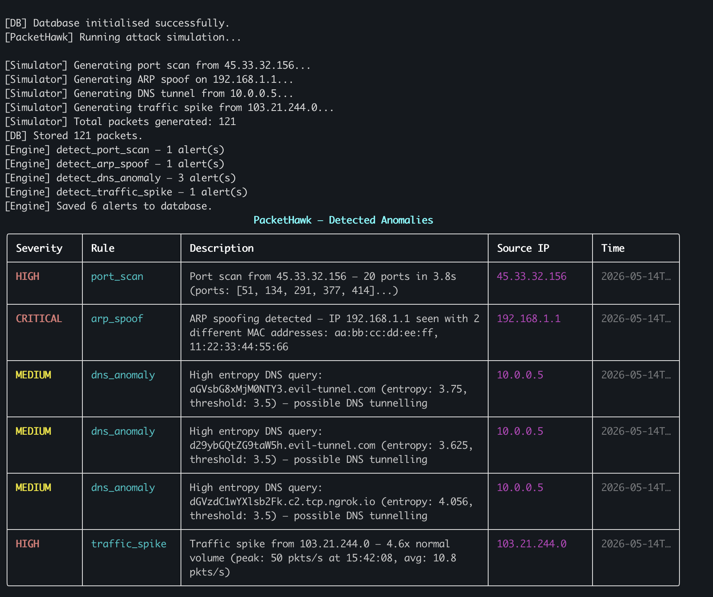
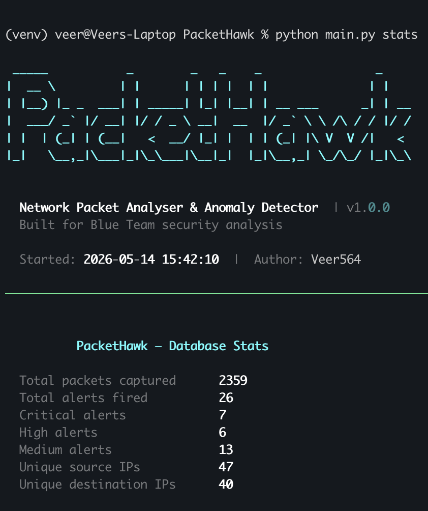
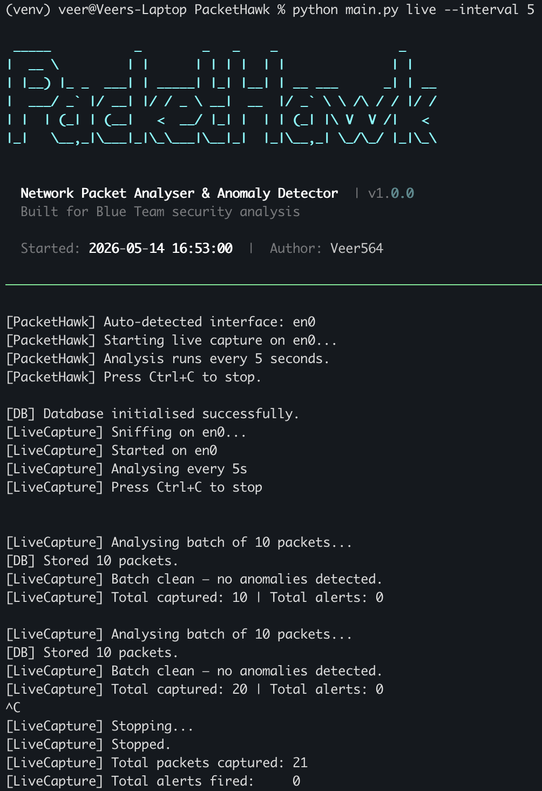
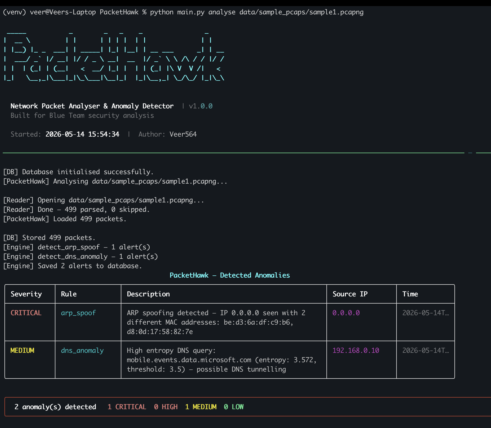

# PacketHawk

**Network Packet Analyser & Anomaly Detector**

PacketHawk is a Python-based network security tool that captures and
analyses network packets in real time, detecting anomalies like port
scans, ARP spoofing, DNS tunnelling, and traffic spikes. Supports
both live capture and offline PCAP file analysis.


---

## What it detects

| Detector | What it catches | Severity |
|---|---|---|
| `port_scan` | One IP hitting 15+ ports in 5 seconds | HIGH |
| `arp_spoof` | Same IP appearing with different MAC addresses | CRITICAL |
| `dns_anomaly` | High-entropy subdomains — DNS tunnelling | MEDIUM |
| `traffic_spike` | Sudden burst 3x above normal baseline | HIGH |

---

## Quick start

```bash
git clone https://github.com/Veer564/PacketHawk.git
cd PacketHawk
python3 -m venv venv && source venv/bin/activate
pip install -e .
pip install -r requirements.txt
cp config.example.yaml config.yaml
python main.py setup
python main.py simulate
```

---

## Commands

| Command | Description |
|---|---|
| `python main.py setup` | Initialise database |
| `python main.py simulate` | Run attack simulation + detect |
| `python main.py analyse <file.pcap>` | Analyse a PCAP file |
| `python main.py live` | Live capture (auto-detects interface) |
| `python main.py live --interface en0` | Live capture on specific interface |
| `python main.py alerts` | Show last 50 saved alerts |
| `python main.py stats` | Show database statistics |
| `python main.py simulate --export report` | Export to JSON + CSV |
| `python main.py analyse <file> --summary` | Show packet summary |

---

## Screenshots

**Attack simulation — all 4 detectors firing**



**Database statistics**



**Real PCAP analysis — live network traffic**



**Sample testing of Wireshark Network Traffic Capture**


---

## Architecture

## Architecture

```
Network Interface (live) / PCAP File (offline)
              ↓
       Packet Capture Engine
       ├── live.py          (Scapy + threading.Lock, auto-detects interface)
       └── pcap_reader.py   (pyshark generator — flat memory, any file size)
              ↓
       PacketSummary Dataclass  (models.py)
              ↓
       Detection Engine  (engine.py)
       ├── port_scan.py     Counter + sliding 5s time window
       ├── arp_spoof.py     IP→MAC conflict tracking
       ├── dns_anomaly.py   Shannon entropy scoring (threshold 3.5)
       └── traffic_spike.py Rolling average, 3x burst detection
              ↓
       SQLite Database  (db.py)
              ↓
       Rich CLI Output
       ├── display.py       Colour-coded alert tables + ASCII banner
       ├── commands.py      Click CLI entry points
       └── exporter.py      JSON + CSV export
```

---

## How each detector works

**Port scan** uses Python's `Counter` to track unique destination
ports per source IP within a sliding 5-second window. 15+ unique
ports in 5 seconds fires a HIGH alert.

**ARP spoof** maintains a `defaultdict` mapping each IP to its
known MAC addresses. A new MAC for an existing IP fires CRITICAL
immediately — classic MITM detection.

**DNS anomaly** calculates Shannon entropy on subdomain strings.
Normal domains score below 3.5. Base64 or random tunnel strings
score above 3.5 and fire MEDIUM.

**Traffic spike** splits packet timestamps into 1-second buckets,
builds a rolling average per IP, and fires HIGH when any second
hits 3x the baseline — catches DDoS and flood attempts.

---

## Live capture architecture

## Live capture architecture

Two threads run simultaneously. A shared packet buffer sits between them, protected by `threading.Lock()` to prevent race conditions.

```
Main thread                         Background thread
──────────────────────────          ──────────────────────────
LiveCapture.start()         →       _capture_worker()
                                    Scapy sniff() loop
                                    (continuous, non-blocking)
                                            ↓
                                    _packet_callback()
                                    acquire lock → append packet
                                            ↓
                                    ┌─────────────────┐
every N seconds:                    │  Packet buffer  │
acquire lock → drain buffer ←────── │  (shared memory)│
release lock                        └─────────────────┘
        ↓                           threading.Lock()
run all 4 detectors                 protects both sides
        ↓
display alerts + store to DB
        ↓
  (loop back)
```

`threading.Event()` is used as a stop flag — Ctrl+C shuts both threads down cleanly without data loss.
---

## Tech stack

| Component | Technology |
|---|---|
| Language | Python 3.13 |
| Live capture | Scapy + threading |
| PCAP parsing | pyshark (generator-based) |
| Database | SQLite |
| CLI | Click + Rich |
| ASCII banner | pyfiglet |
| Testing | pytest (19 tests) |
| CI | GitHub Actions |

---

## Tested on

- macOS Sequoia (primary development)
- Ubuntu 22.04 (via GitHub Actions CI)
- Windows 10/11 (with Npcap + Wireshark installed)

---

## Project structure

```
PacketHawk/
├── packethawk/
│   ├── capture/
│   │   ├── live.py          # live capture, threading, cross-platform
│   │   ├── pcap_reader.py   # generator-based PCAP reader
│   │   └── models.py        # PacketSummary + Alert dataclasses
│   ├── detection/
│   │   ├── engine.py        # runs all detectors
│   │   └── detectors/
│   │       ├── port_scan.py
│   │       ├── arp_spoof.py
│   │       ├── dns_anomaly.py
│   │       └── traffic_spike.py
│   ├── storage/
│   │   └── db.py            # SQLite
│   └── cli/
│       ├── display.py       # Rich tables + ASCII banner
│       ├── exporter.py      # JSON + CSV export
│       └── commands.py
├── tests/                   # 19 pytest tests
├── simulate_packets.py      # attack traffic generator
├── config.example.yaml
└── main.py                  # CLI entry point
```
